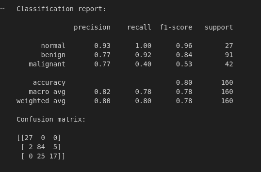
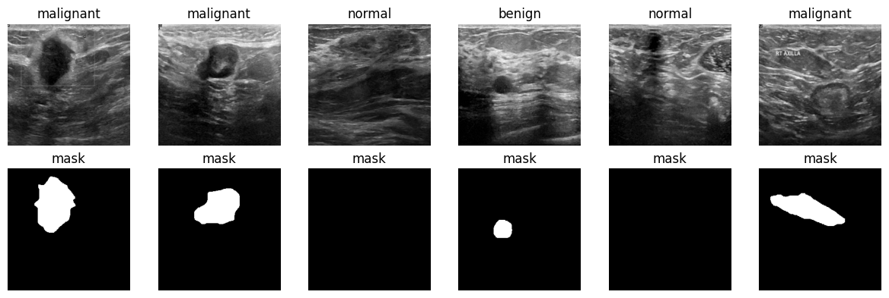
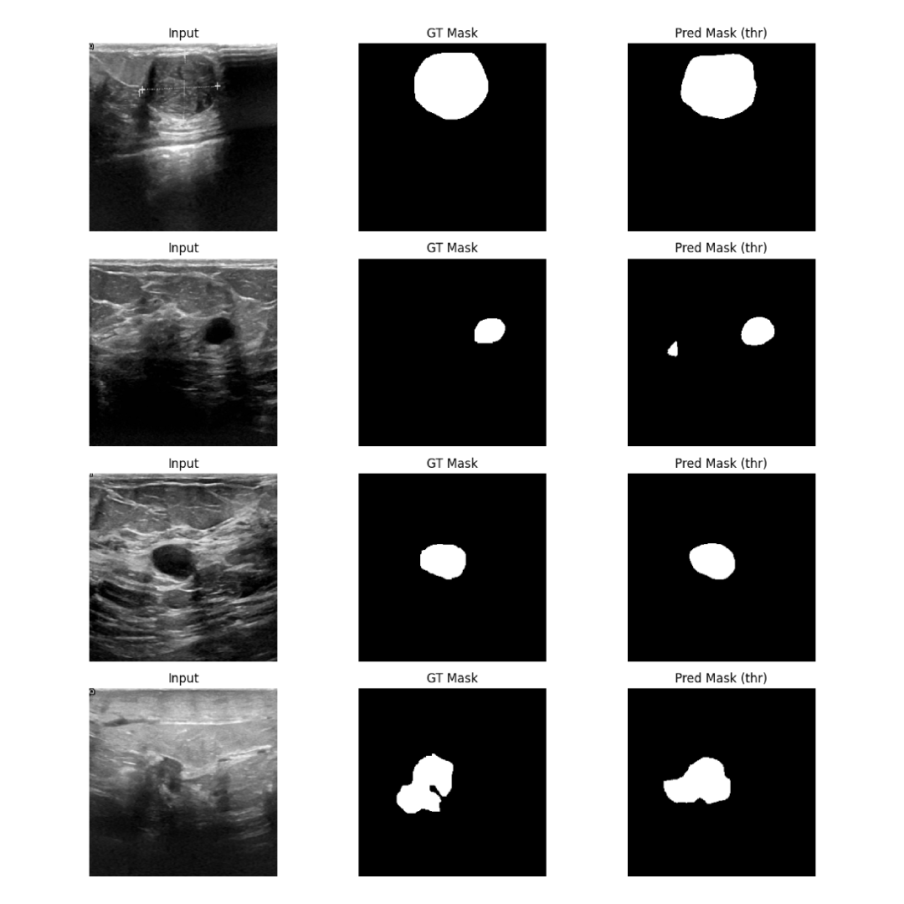

# Breast Ultrasound Lesion Segmentation + Diagnosis (U-Net + Classifier)

A two-stage deep learning pipeline for **breast ultrasound analysis** using the BUSI dataset.

This project combines:

1. **U-Net segmentation** → predicts lesion mask, with a
2. **Classifier** → predicts diagnosis (**normal / benign / malignant**) using the predicted mask

---

## Demo


## Model Results


## Dataset

**Breast Ultrasound Images Dataset (BUSI)**  
https://www.kaggle.com/datasets/aryashah2k/breast-ultrasound-images-dataset

### Dataset Structure

```
DATASET_ROOT/
├── benign/
│   ├── image.png
│   ├── image_mask.png
├── malignant/
│   ├── image.png
│   ├── image_mask.png
├── normal/
│   └── image.png
```

Notes:
- Masks exist mostly for benign and malignant
- Normal class is treated as **empty mask**

## Model Results on Test data:



---


## Repository Structure

```
Breast_Cancer_Detection_Deep_Learning/
├── Breast_Cancer_Detection_Deep_Learning.ipynb
├── src/
│   ├── data.py
│   ├── unet_model.py
│   ├── classifier_model.py
│   ├── train_unet.py
│   ├── train_classifier.py
│   └── infer.py
├── models/
├── reports/
│   └── figures/
├── requirements.txt
└── README.md
```


---

## Installation

### 1. Clone repository
git clone https://github.com/Gokulos/Breast_Cancer_Detection_Deep_Learning.git
cd Breast_Cancer_Detection_Deep_Learning

### 2.Create a Virtual Environment(Optional)
```
python -m venv busi
source busi/bin/activate        # Linux / Mac
busi\Scripts\activate         # Windows
```
### 3. Install Requirements
```
pip install -r requirements.txt
```

## Method Overview
```
Segmentation (U-Net)

- Encoder–decoder CNN with skip connections
- Predicts binary lesion mask
- Trained using **BCE + Dice loss**
- Evaluated using Dice coefficient

Classification

Classifier input:
- Channel 1 → original ultrasound image
- Channel 2 → predicted lesion mask

Outputs:
- Normal
- Benign
- Malignant
```
---

